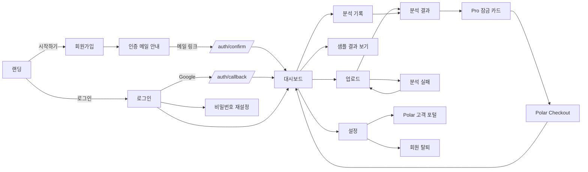
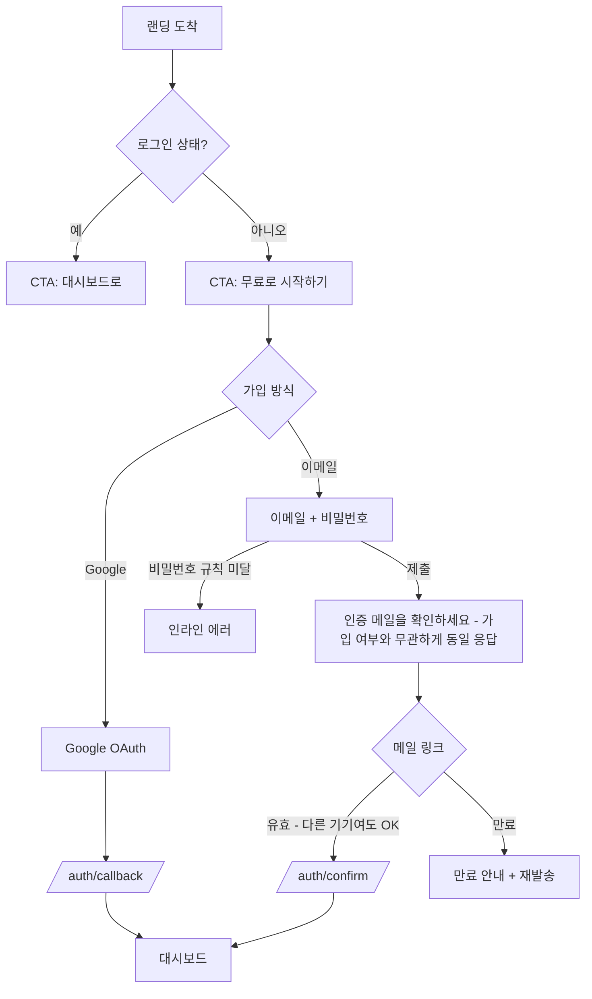
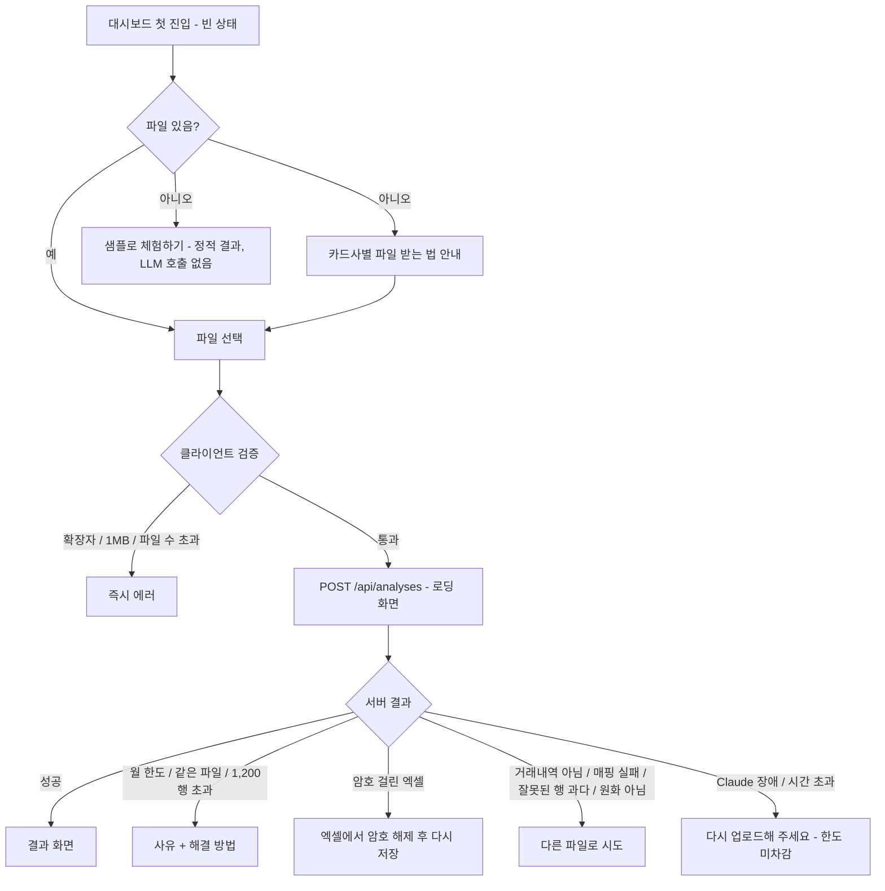
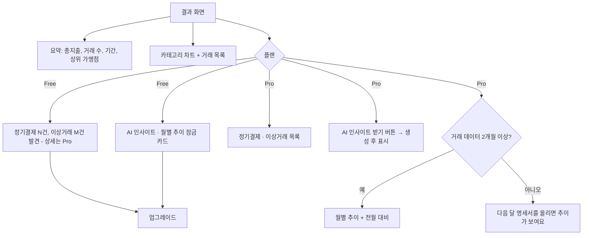
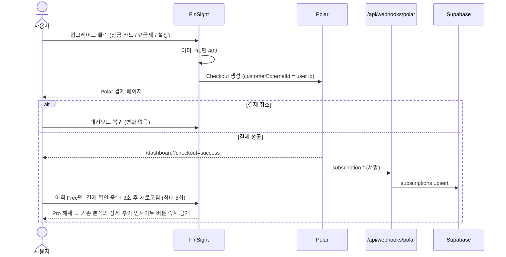
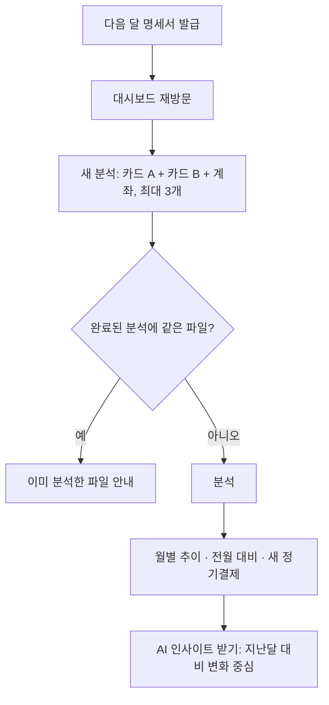
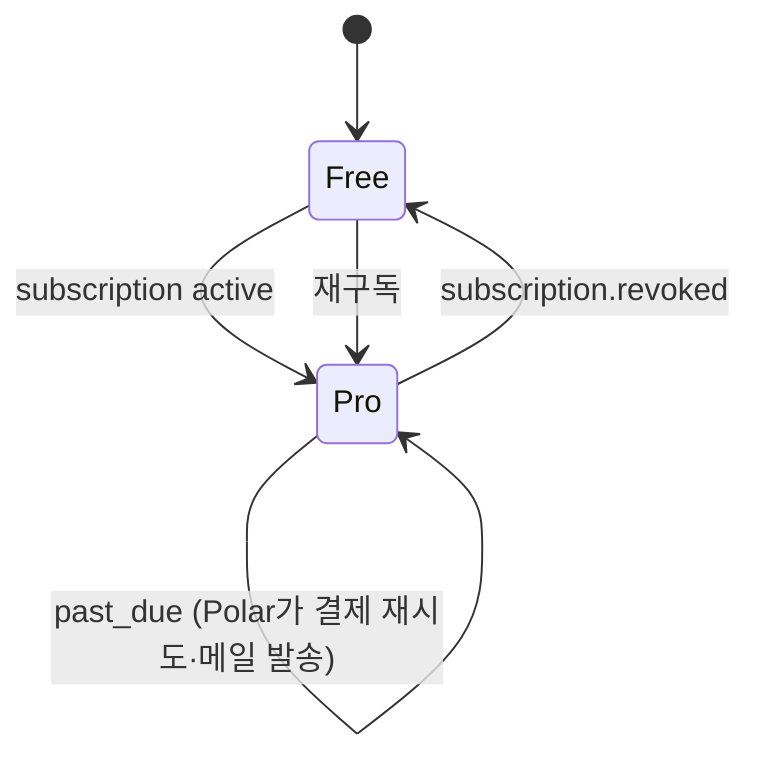
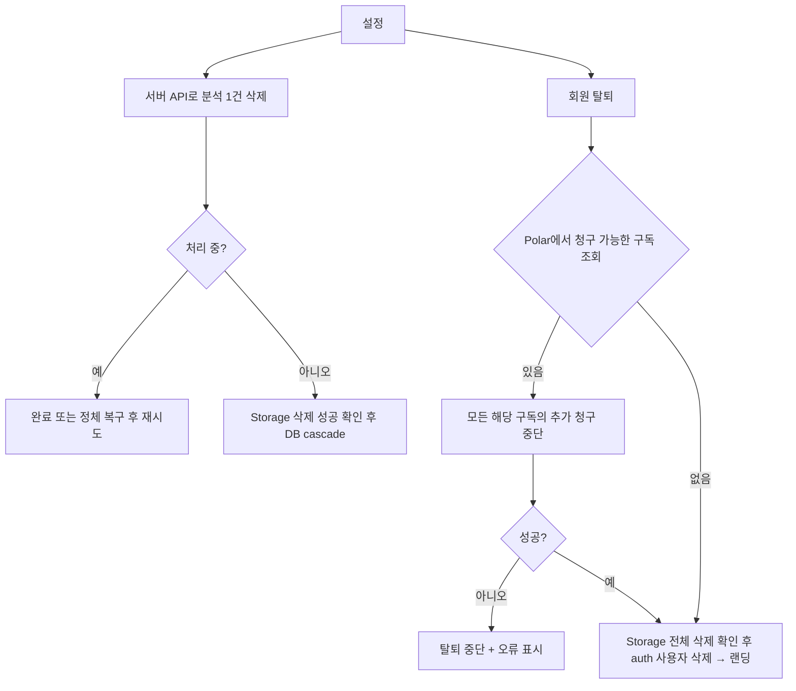

# 사용자 흐름 · 여정 · 가설

> 이 문서가 페르소나·흐름·시나리오·가설의 원본이다. 절 번호(2~4, 8)와 시나리오 번호(1.x~7.x)는 step 문서에서 그대로 참조하며, 테스트 이름과 step AC에 연결한다.

## 2. 페르소나

| 페르소나 | 상황 | 동기 | 이탈 위험 |
|---|---|---|---|
| **P1 방문자** | 광고·검색으로 랜딩 도착 | 내 돈이 어디로 새는지 알고 싶음 | 가치를 못 느낌, 금융 데이터 업로드 불안 |
| **P2 Free 사용자** | 이번 달 명세서 1장 분석 | 한 번 정리해보고 싶음 | 파일 받는 법 모름, 분석 실패, 결과가 뻔함 |
| **P3 Pro 사용자** | 카드 2~3장 + 계좌, 매달 업로드 | 전체 지출 추적, 새는 돈 찾기 | 매달 올리는 걸 잊음 |
| **P4 해지 사용자** | 구독 해지·결제 실패 | 비용 대비 가치 재평가 | 데이터가 사라질까 걱정 |

---

## 3. 화면 흐름

---

## 4. 사용자 여정

### J1. 발견 → 가입 (P1)

| # | 시나리오 | 동작 |
|---|---|---|
| 1.1 | 미인증 상태로 로그인 | "이메일 인증이 필요합니다" + 재발송 |
| 1.2 | 이메일 가입자가 같은 이메일로 Google 로그인 | Supabase가 identity 자동 연결 |
| 1.3 | 비밀번호 분실 | 재설정 메일(`/auth/confirm`, type=recovery) → 새 비밀번호 → 대시보드 |
| 1.4 | 로그인 상태에서 `/login` | `/dashboard`로 이동 |
| 1.5 | 비로그인으로 `/dashboard/*` 접근 | `/login`으로 이동, 로그인 후 항상 `/dashboard` |
| 1.6 | OAuth 취소·에러 | 로그인 화면 + 에러 메시지 |

### J2. 첫 분석 — 활성화 (P2, 가장 중요)

| # | 시나리오 | 동작 |
|---|---|---|
| 2.1 | 분석 중 탭 닫음 | 업로드가 서버에 도착한 이후에는 연결 종료만으로 분석을 취소하지 않음. 다음 방문 시 저장 결과 또는 실패 상태 표시 |
| 2.2 | 6분 넘게 `processing`인 분석 | 대시보드·상세 조회·업로드·삭제 진입 시 서버가 `failed/timeout`으로 전환 (5.2.2) |
| 2.3 | 업로드 중 버튼 재클릭·다른 탭에서 업로드 | 버튼 비활성 + 사용자당 처리 중 1건(부분 unique index). 추가 요청은 409 `analysis_in_progress` |
| 2.4 | 세션 만료 상태로 업로드 | 401 → 로그인 화면 |
| 2.5 | 완료된 분석을 삭제하고 다시 업로드 | 이번 달 성공 사용량은 유지. 삭제로 한도나 사용 횟수를 되돌리지 않음 |

### J3. 결과 확인 (P2/P3)

| # | 시나리오 | 동작 |
|---|---|---|
| 3.1 | 계좌 파일에 카드대금 출금 포함 | `transfer`·`income`은 지출 합계에서 제외 |
| 3.2 | 명세서 기간이 월을 걸침 | 추이는 **거래일 기준 월**로 집계 |
| 3.3 | 모바일 | 차트 1열, 거래 목록은 카드형 |
| 3.4 | Free가 결과를 조회 | 모든 분석을 열람 가능. 일반 거래 목록에는 `isRecurring`·`anomalyType` 미포함. 탐지 건수만 제공하고 상세·추이·기존 인사이트는 서버에서 제외 |

### J4. 업그레이드 (P2 → P3)

### J5. 월간 재방문 (P3)

| # | 시나리오 | 동작 |
|---|---|---|
| 5.1 | 3개 중 1개 파일이 파싱 실패 | 분석 전체 실패 + 어느 파일인지 표시 (부분 성공 처리는 안 함) |
| 5.2 | 월 한도 도달 | 다음 달 1일(UTC) 새 사용량 구간 안내. 월 경계를 넘겨 완료한 분석도 분석 시작 월에 귀속 |
| 5.3 | 과거 분석 삭제 | 해당 거래는 추이에서도 빠짐. 성공 사용량 원장은 유지 |

### J6. 해지 · 결제 실패 · 재구독 (P4)

| # | 시나리오 | 동작 |
|---|---|---|
| 6.1 | Pro → Free | 과거 분석은 모두 유지·열람 가능. 탐지 상세·추이·인사이트만 잠김. 재구독 시 즉시 복원 |
| 6.2 | 구독 상태 확인 | 설정 페이지에 상태 한 줄 (예: "Pro · 10월 29일에 종료 예정") |
| 6.3 | 해지·결제수단 변경 | Polar 고객 포털 |

### J7. 데이터 · 계정 관리

- 업로드 영역 하단: "원본 파일은 분석 기록을 위해 저장되며, 언제든 삭제할 수 있습니다" + 개인정보 처리방침 링크
- 삭제는 5.3.3의 재시도 가능한 순서를 따른다. Storage 또는 Polar 처리가 실패하면 연결 정보와 계정을 남기고 오류를 표시한다.

---

## 8. 제품 가설과 측정

측정은 별도 이벤트 수집 없이 **기존 테이블 SQL + Vercel Analytics 페이지뷰**로 한다.

| ID | 가설 | 실패 신호 | 측정 | 대응 |
|---|---|---|---|---|
| H1 | 사용자는 명세서 파일을 쉽게 구한다 | 가입 후 첫 분석률 < 40% | `auth.users` vs `analyses` | 카드사별 안내 강화 |
| H2 | 형식과 상관없이 분석된다 | 성공률 < 90% | `analyses.status`, `error_code` 분포 | 저장된 원본으로 실패 원인 분석, 프롬프트 개선 |
| H3 | 자동 분류를 신뢰한다 | 인터뷰에서 불만 | 초기 사용자 인터뷰 | 카테고리 수정 기능 |
| H4 | 원본 저장 고지가 업로드를 막지 않는다 | 대시보드 방문 대비 업로드 낮음 | 페이지뷰 vs `analyses` | 원본 자동 삭제 옵션 |
| H5 | Pro 잠금 카드·티저가 결제를 유도한다 | 결제 전환 < 3% | `subscriptions` / 활성 사용자 | 티저 문구 변경 |
| H6 | $9/월을 낸다 | 결제 페이지 도달 대비 완료 낮음 | Polar 대시보드 | 가격 조정 |
| H7 | 매달 돌아온다 | 2개월 차 재분석 < 30% | `analyses` 월별 코호트 | 리마인더 메일 |
| H8 | 여러 카드 통합이 Pro 핵심이다 | Pro 분석당 파일 수 ≈ 1 | `uploads` / `analyses` | Pro 가치 재정의 |
