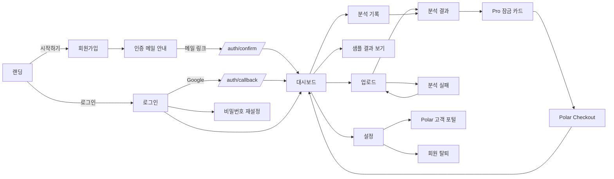
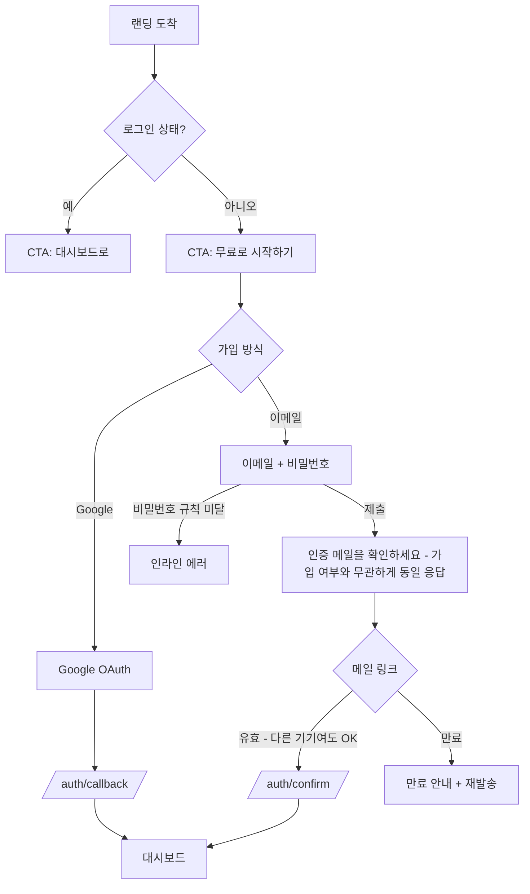
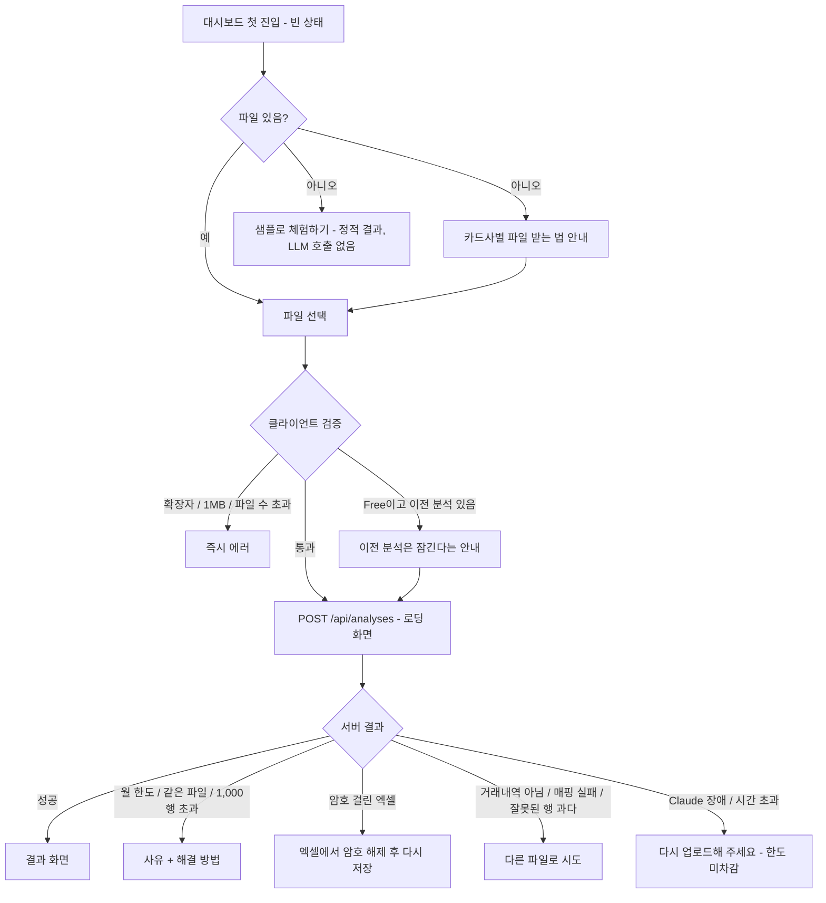
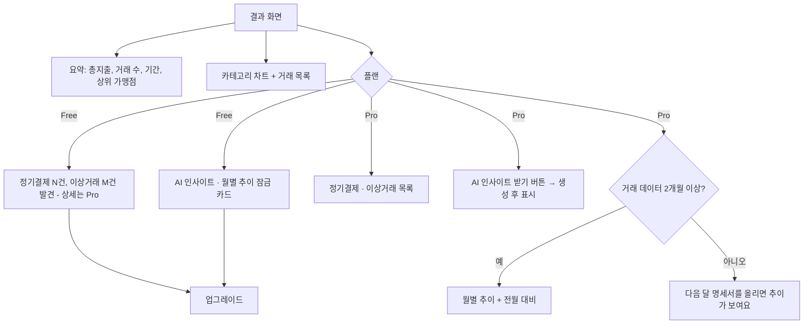
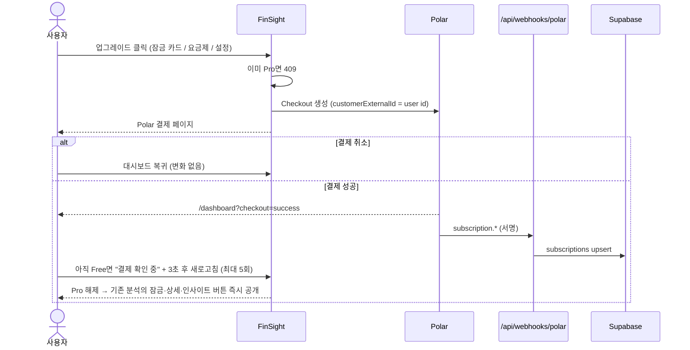
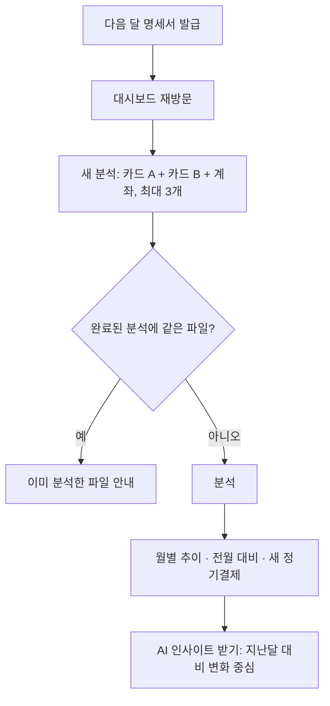
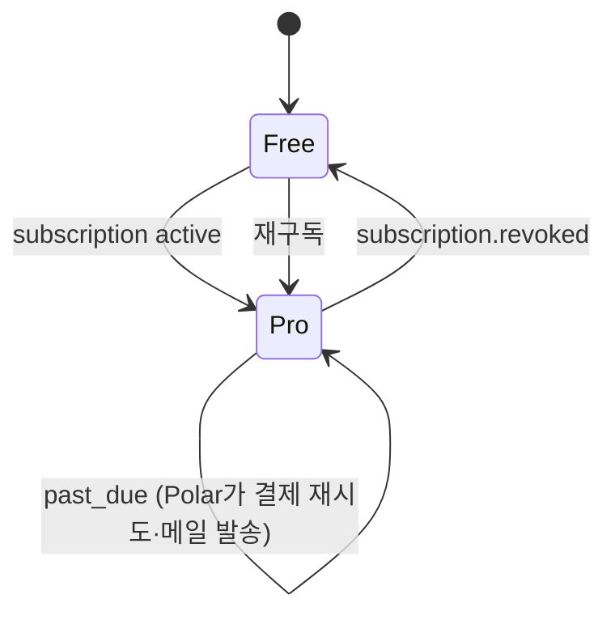
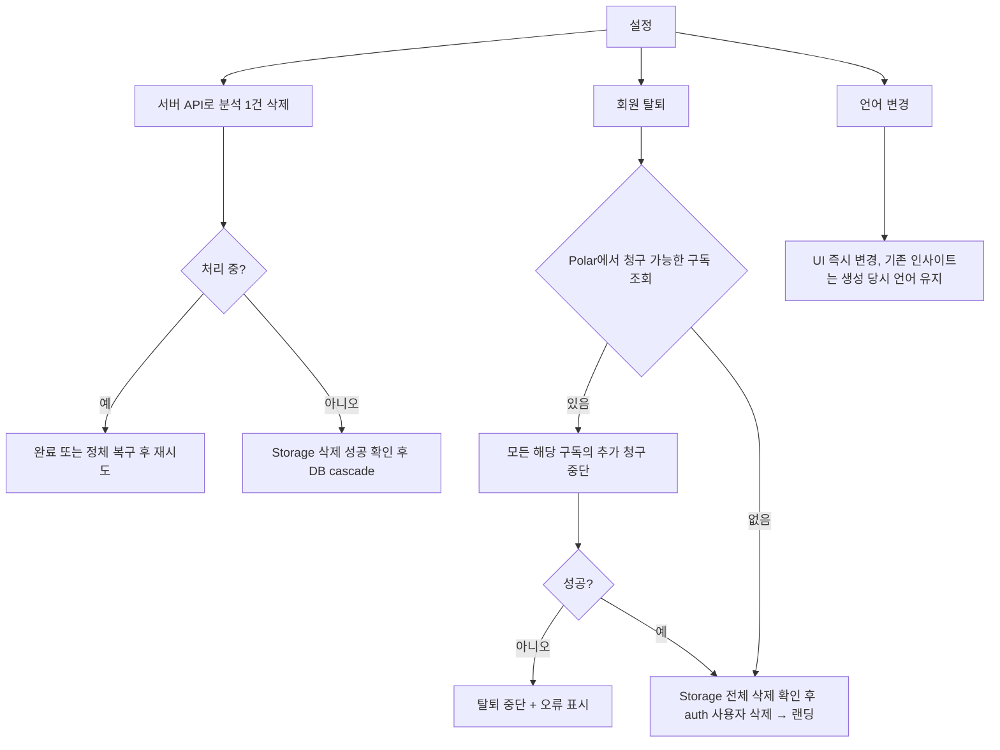

# FinSight MVP 계획

카드 명세서·거래내역 파일(CSV/엑셀)을 올리면 Claude가 지출을 분류·요약하고, Pro 사용자에게는 누적 추이·정기결제/이상거래·절약 조언을 제공하는 SaaS.
목표는 **프로토타입 수준의 MVP**: 랜딩 → 로그인 → 분석 → 결제 → 배포까지 동작하되, 첫 사용자에게 필요 없는 것은 만들지 않는다.

---

## 1. 확정 결정

| 영역 | 결정 |
|---|---|
| 프레임워크 | Next.js 16 (App Router, `proxy.ts`), TypeScript strict, Tailwind |
| 인증·DB·파일 | Supabase (`@supabase/ssr`, publishable/secret 키, 서울 리전) |
| LLM | Claude Opus 5.5 (`claude-opus-5-5`) 단일 모델, structured outputs, 모델 ID는 env |
| 결제 | Polar (`@polar-sh/nextjs`), Pro $9/월, `customerExternalId` = Supabase user id |
| 다국어 | next-intl **쿠키 기반** (ko/en, URL에 로케일 없음) |
| 파일 파싱 | SheetJS 0.20.3 (CDN tarball 설치) + `TextDecoder`로 UTF-8/CP949 엄격 디코딩 — CSV·xlsx·xls·HTML-xls 공통 |
| 통화 | 분석당 검증된 ISO 4217 통화 1개, 파일 간 혼합 통화는 거부, 누적 추이는 같은 통화끼리 집계 |
| 데이터 접근·사용량 | 금융 원본 테이블은 서버 전용, 삭제와 독립적인 성공 사용량 원장 + 사용자당 처리 중 분석 1건(부분 unique index) |
| 차트 | Recharts |
| 테스트 | Vitest + Testing Library |
| 배포 | **Vercel CLI로 매 step 완료 시 자동 배포** (11.3). Claude·Polar는 mock으로 먼저 배포 → 키가 준비되면 실제로 전환. 결제를 켜는 시점에 Vercel Pro, Supabase 무료로 시작 |

### Free / Pro

| | Free | Pro ($9/월) |
|---|---|---|
| 분석당 파일 수 | 1개 | 최대 3개 (여러 카드·계좌 통합) |
| 파일 한도 | 1MB · 후보 거래 1,000행, 헤더·안내행 포함 시트 1,200행 (5.2.1) | 동일 (분석당 후보 거래 최대 3,000행) |
| 월 분석 횟수 | 성공 5회 (실패는 미차감, 삭제해도 복구 안 됨) | 성공 50회 |
| 카테고리 분류·요약·차트 | ✅ | ✅ |
| 열람 가능한 분석 | 최신 1건 (이전 분석은 **삭제하지 않고 잠금**) | 전체 |
| 정기결제·이상거래 | 발견 **건수만** (티저) | 상세 목록 |
| 월별 추이·전월 대비 | – | ✅ |
| AI 인사이트·절약 조언 | – | ✅ (결과 화면 버튼으로 생성) |

---

## 2. 페르소나

| 페르소나 | 상황 | 동기 | 이탈 위험 |
|---|---|---|---|
| **P1 방문자** | 광고·검색으로 랜딩 도착 | 내 돈이 어디로 새는지 알고 싶음 | 가치를 못 느낌, 금융 데이터 업로드 불안 |
| **P2 Free 사용자** | 이번 달 명세서 1장 분석 | 한 번 정리해보고 싶음 | 파일 받는 법 모름, 분석 실패, 결과가 뻔함 |
| **P3 Pro 사용자** | 카드 2~3장 + 계좌, 매달 업로드 | 전체 지출 추적, 새는 돈 찾기 | 매달 올리는 걸 잊음 |
| **P4 해지 사용자** | 구독 해지·결제 실패 | 비용 대비 가치 재평가 | 데이터가 사라질까 걱정 |

---

## 3. 화면 흐름



---

## 4. 사용자 여정

### J1. 발견 → 가입 (P1)



| # | 시나리오 | 동작 |
|---|---|---|
| 1.1 | 첫 방문 언어 | `Accept-Language`로 ko/en 결정 → 쿠키 저장 |
| 1.2 | 미인증 상태로 로그인 | "이메일 인증이 필요합니다" + 재발송 |
| 1.3 | 이메일 가입자가 같은 이메일로 Google 로그인 | Supabase가 identity 자동 연결 |
| 1.4 | 비밀번호 분실 | 재설정 메일(`/auth/confirm`, type=recovery) → 새 비밀번호 → 대시보드 |
| 1.5 | 로그인 상태에서 `/login` | `/dashboard`로 이동 |
| 1.6 | 비로그인으로 `/dashboard/*` 접근 | `/login`으로 이동, 로그인 후 항상 `/dashboard` |
| 1.7 | OAuth 취소·에러 | 로그인 화면 + 에러 메시지 |

### J2. 첫 분석 — 활성화 (P2, 가장 중요)



| # | 시나리오 | 동작 |
|---|---|---|
| 2.1 | 분석 중 탭 닫음 | 업로드가 서버에 도착한 이후에는 연결 종료만으로 분석을 취소하지 않음. 다음 방문 시 저장 결과 또는 실패 상태 표시 |
| 2.2 | 6분 넘게 `processing`인 분석 | 대시보드·상세 조회·업로드·삭제 진입 시 서버가 `failed/timeout`으로 전환 (5.2.2) |
| 2.3 | 업로드 중 버튼 재클릭·다른 탭에서 업로드 | 버튼 비활성 + 사용자당 처리 중 1건(부분 unique index). 추가 요청은 409 `analysis_in_progress` |
| 2.4 | 세션 만료 상태로 업로드 | 401 → 로그인 화면 |
| 2.5 | 완료된 분석을 삭제하고 다시 업로드 | 이번 달 성공 사용량은 유지. 삭제로 한도나 사용 횟수를 되돌리지 않음 |

### J3. 결과 확인 (P2/P3)



| # | 시나리오 | 동작 |
|---|---|---|
| 3.1 | 계좌 파일에 카드대금 출금 포함 | `transfer`·`income`은 지출 합계에서 제외 |
| 3.2 | 명세서 기간이 월을 걸침 | 추이는 **거래일 기준 월**로 집계 |
| 3.3 | Free 사용자가 잠긴 분석 URL 접근 | 요약 없이 잠금 화면 + 업그레이드 CTA |
| 3.4 | 모바일 | 차트 1열, 거래 목록은 카드형 |
| 3.5 | KRW·USD 분석 이력이 함께 있음 | 현재 분석의 통화와 같은 완료 이력만 추이·탐지·인사이트에 사용, 차트에 통화와 '업로드된 거래 기준' 표시 |
| 3.6 | Free가 결과를 조회 | 일반 거래 목록에는 `isRecurring`·`anomalyType` 미포함. 탐지 건수만 제공하고 상세·추이·기존 인사이트는 서버에서 제외 |

### J4. 업그레이드 (P2 → P3)



### J5. 월간 재방문 (P3)



| # | 시나리오 | 동작 |
|---|---|---|
| 5.1 | 3개 중 1개 파일이 파싱 실패 | 분석 전체 실패 + 어느 파일인지 표시 (부분 성공 처리는 안 함) |
| 5.2 | 월 한도 도달 | 다음 달 1일(UTC) 새 사용량 구간 안내. 월 경계를 넘겨 완료한 분석도 분석 시작 월에 귀속 |
| 5.3 | 과거 분석 삭제 | 해당 거래는 추이에서도 빠짐. 성공 사용량 원장은 유지 |
| 5.4 | 서로 다른 통화의 파일을 한 번에 업로드 | 분석 전체 실패 + `mixed_currency`. 같은 통화 파일끼리 나누어 업로드하도록 안내 |

### J6. 해지 · 결제 실패 · 재구독 (P4)



| # | 시나리오 | 동작 |
|---|---|---|
| 6.1 | Pro → Free | 과거 분석은 삭제하지 않고 잠금, 최신 1건만 열람. 재구독 시 즉시 복원 |
| 6.2 | 구독 상태 확인 | 설정 페이지에 상태 한 줄 (예: "Pro · 10월 29일에 종료 예정") |
| 6.3 | 해지·결제수단 변경 | Polar 고객 포털 |

### J7. 데이터 · 계정 관리



- 업로드 영역 하단: "원본 파일은 분석 기록을 위해 저장되며, 언제든 삭제할 수 있습니다" + 개인정보 처리방침 링크
- 삭제는 5.3.3의 재시도 가능한 순서를 따른다. Storage 또는 Polar 처리가 실패하면 연결 정보와 계정을 남기고 오류를 표시한다.

---

## 5. 아키텍처

### 5.1 디렉토리 구조
```
src/
├── app/
│   ├── page.tsx                     # 랜딩
│   ├── login/ signup/ reset-password/
│   ├── dashboard/
│   │   ├── page.tsx                 # 업로드 + 기록 + 빈 상태/샘플
│   │   └── analyses/[id]/page.tsx   # 결과
│   ├── settings/page.tsx
│   ├── auth/callback/route.ts       # OAuth code 교환
│   ├── auth/confirm/route.ts        # 이메일 인증·비밀번호 재설정 (token_hash)
│   ├── api/                         # 5.4 참고
│   ├── error.tsx  not-found.tsx
├── components/{ui,landing,dashboard}/
├── lib/
│   ├── supabase/{server,browser,admin}.ts   # admin은 'server-only'
│   ├── data/         # server-only 조회·RPC 래퍼, 모든 사용자 쿼리에 claims.sub 소유권 조건
│   ├── sheet/        # readRows, normalize (순수 함수)
│   ├── analysis/     # summarize, detect, monthlyTrend (순수 함수)
│   ├── plan.ts       # resolvePlan, limits, canViewAnalysis, toAnalysisView
│   ├── api-error.ts  # apiError(code, status)
│   └── log.ts        # logError(event, meta) — 파일 내용 기록 금지
├── services/
│   ├── claude.ts
│   ├── polar.ts
│   ├── analysis-pipeline.ts
│   └── deletion.ts   # Storage·Polar·DB 삭제 순서와 재시도
├── messages/{ko,en}.json
├── sample/analysis.{ko,en}.json     # 샘플 결과 (AnalysisView 형태)
├── types/
└── proxy.ts                         # Supabase 세션 갱신 + /dashboard·/settings 보호
supabase/migrations/
```

### 5.2 분석 흐름 (동기)
```
업로드 폼 → POST /api/analyses (multipart, maxDuration = 300)
  1. getClaims()로 인증, 파일 수·크기 검증
  2. 파일별 sha256 → 완료된 분석에 같은 해시가 있으면 409 duplicate_file
  3. startAnalysis: 6분 넘은 processing을 failed/timeout으로 정리 →
     원장에서 이번 달(UTC) 성공 수 확인(한도 이상이면 429 monthly_limit) →
     analyses(processing) insert. 부분 unique index 위반이면 409 analysis_in_progress (5.3.2)
  4. uploads에 경로를 먼저 기록한 뒤 Storage에 원본 저장 (서버 생성 경로)
  5. readRows: 엄격 디코딩 + 첫 시트 추출 + 행·컬럼·셀 상한 검증 (5.2.1)
  6. Claude mapColumns(헤더 후보와 샘플) → ColumnMapping
  7. normalize에서 먼저 후보 거래행 1,000행 상한 검사. 잘못된 행 20% 초과 시 실패
     통화를 판정(E10)하고, 행·파일 간 통화 불일치 시 mixed_currency
  8. 고유 가맹점만 Claude classifyMerchants (100개 배치, 동시 요청 최대 2개)
  9. summarize + detect (항상 계산). history는 본인·completed·현재 통화 조건으로 조회
 10. completeAnalysis RPC (한 트랜잭션): analyses를 WHERE id AND user_id AND status='processing'으로
     completed 전환 → 0건이면 중단(이미 timeout 처리됨) → transactions insert → 사용량 원장 row insert
실패 시: UPDATE analyses SET status='failed', error_code WHERE id AND user_id AND status='processing'
         원본·uploads는 실패 원인 확인과 사용자 삭제를 위해 유지, 거래 데이터는 남기지 않음
응답: 201 { analysisId } → 클라이언트가 결과 페이지로 이동
```

### 5.2.1 파일 읽기·행수·인코딩

- **거래 한도와 읽기 상한을 분리한다.** 헤더 이후 비어 있지 않은 행에서 명확히 식별된 반복 헤더·합계·소계만 제외한 것을 '후보 거래행'으로 정의한다. 잘못된 날짜·금액과 0원 행도 한도 계산에는 포함한다. 후보가 1,000행을 넘으면 정규화로 버리기 전에 `too_many_rows`로 거부한다.
- 시트는 제목·헤더·빈 행·합계까지 포함해 최대 1,200행을 지원한다. `sheetRows: 1201`로 읽어 **1,201번째 행이 있으면 `too_many_sheet_rows`로 거부**한다. 잘린 결과로 분석하지 않는다. CSV의 인용부호 안 줄바꿈은 1행으로 센다. 첫 시트 외 거래 시트 선택은 MVP에서 지원하지 않고 업로드 안내에 명시한다.
- 컬럼 50개·셀 500자 상한을 넘으면 `file_structure_limit`로 거부한다.
- CSV와 HTML-xls는 BOM을 처리한 뒤 `new TextDecoder('utf-8', { fatal: true })`로 디코딩하고, 실패하면 `new TextDecoder('euc-kr', { fatal: true })`(CP949 확장 문자 포함)로 디코딩한다. 둘 다 실패하면 `unsupported_encoding`; 깨진 문자를 대체해 분석을 계속하지 않는다. 디코딩한 문자열을 SheetJS에 넘긴다(구분자는 SheetJS가 판별).
- 바이너리 xls/xlsx에는 텍스트 디코딩을 적용하지 않는다. 레거시 xls용 codepage 지원(`cpexcel`)을 로드한다. UTF-8 BOM·BOM 없는 UTF-8·CP949 확장 문자·CP949 HTML-xls를 fixture로 검증한다.
- 구조행을 제외한 후보 중 날짜·금액 오류 비율이 20%를 넘으면 실패한다. `skippedRows`에는 제외한 잘못된 후보 및 0원 행을 센다. 날짜 파싱 실패만으로 합계행이라고 간주하지 않는다.

### 5.2.2 실행 시간·정체 복구

- 분석 라우트 `maxDuration = 300`. Claude SDK는 호출별 `timeout`과 `maxRetries: 1`을 설정한다. 값은 6단계에서 Opus 5.5의 실제 응답 시간(가맹점 100개 분류 기준)을 재서 정하고, Pro 최대 입력(3파일·3,000행)이 240초 안에 끝나는지 확인한다. 넘으면 배치 크기·동시 요청 수를 조정한다.
- 대시보드·분석 상세·업로드·삭제의 서버 진입점은 `recoverStaleAnalyses(userId)`를 호출한다: `UPDATE analyses SET status='failed', error_code='timeout' WHERE user_id AND status='processing' AND created_at < now() - 6분`. 기준(6분)이 최대 실행 시간(5분)보다 길어 아직 실행 중인 요청을 실패로 바꾸지 않는다.
- 늦게 끝난 요청은 `completeAnalysis`의 `status='processing'` 조건에 걸려 아무것도 저장하지 못한다. 거래 insert·완료 전환·사용량 기록이 한 트랜잭션이라 강제 종료돼도 일부 거래만 남지 않는다. 읽기에는 `completed` 분석의 거래만 사용한다.
- 클라이언트 연결 종료를 분석 취소로 연결하지 않는다. 연결 종료 후에도 처리가 끝까지 도는지는 배포 환경에서 확인한다.

### 5.3 데이터베이스

| 테이블 | 컬럼 |
|---|---|
| `profiles` | `id`(= auth.users.id), `locale`, `created_at` — `handle_new_user` 트리거로 생성 |
| `subscriptions` | `id`, `user_id`, `polar_subscription_id` unique, `polar_customer_id`, `status`, `cancel_at_period_end`, `current_period_end`, `updated_at` |
| `analyses` | `id`, `user_id`, `status`(processing/completed/failed), `error_code`, `failed_upload_id` nullable, `currency` (processing 중 nullable), `summary` jsonb, `detections` jsonb, `insights` jsonb, `insights_locale`, `created_at`, `completed_at` nullable |
| `uploads` | `id`, `analysis_id`, `user_id`, `original_filename`, `storage_path`, `file_hash`, `row_count`, `column_mapping` jsonb |
| `transactions` | `id`, `analysis_id`, `user_id`, `occurred_on` date, `amount` numeric(14,2) (항상 양수), `currency`, `direction`(debit/credit), `merchant`, `description`, `category`, `is_recurring`, `anomaly_type` |
| `analysis_usage` | `analysis_id` uuid PK (analyses에 FK 없음), `user_id`, `usage_month` date (분석 시작 시각의 UTC 월 첫날), `created_at` — **성공한 분석만** 기록 |

- 인덱스: `transactions(user_id, currency, occurred_on)`, `uploads(user_id, file_hash)`, `analysis_usage(user_id, usage_month)`, **`analyses(user_id) WHERE status = 'processing'` 부분 unique 인덱스**로 사용자당 처리 중 분석 1건을 보장한다.
- 무결성: analyses에 `(id, user_id)`·`(id, user_id, currency)` unique 제약을 두고, uploads와 transactions가 각각 해당 조합을 참조하게 한다. 완료 분석의 currency는 필수이며 허용된 ISO 4217 코드 목록으로 검증한다. 파일별 오류의 upload ID도 동일 분석·사용자 소유인지 확인한다.
- 삭제: `analyses` → `uploads`, `transactions` cascade. **`analysis_usage`는 분석 삭제에 cascade하지 않는다.** `auth.users` 삭제 시에는 원장을 포함한 전 사용자 테이블 cascade.
- Storage: private 버킷 `csv-uploads`, `file_size_limit` 1MB, 클라이언트 정책 없음(서버만 읽기/쓰기)
- 카테고리 enum: `food, cafe, groceries, transport, shopping, subscription, utilities, housing, health, education, entertainment, travel, transfer, income, other`

### 5.3.1 접근 권한

- 모든 테이블에 RLS를 켜고, 마이그레이션에서 `anon`·`authenticated`의 기존 테이블 권한을 먼저 회수한다. `profiles`·`subscriptions`만 `authenticated`에 SELECT를 다시 허용하고 본인 row RLS를 적용한다. **모든 테이블의 클라이언트 INSERT/UPDATE/DELETE는 금지**한다.
- `analyses`·`uploads`·`transactions`·`analysis_usage`는 클라이언트 SELECT도 금지한다. 이들을 노출하는 view·RPC에 우회 권한을 주지 않는다. `completeAnalysis` RPC는 `PUBLIC`·`anon`·`authenticated`의 EXECUTE를 회수하고 `service_role`에만 허용한다.
- 금융 데이터는 `server-only`인 `lib/data`에서 secret key로 조회한다. 이 클라이언트는 RLS를 우회하므로 **인증된 `claims.sub`와 row 소유권을 매번 검사**한다. ID 조회·삭제는 항상 `id = 요청 ID AND user_id = claims.sub`, 이력·파일 조회도 같은 사용자 조건을 사용한다. 알 수 없는 ID와 타인 ID는 동일한 404를 반환한다.
- 조회 순서: 소유권 → 플랜과 최신 완료 분석 확인 → 열람 권한 → 필요한 거래/추이 조회 → `toAnalysisView` 직렬화. Server Component와 GET API는 같은 경로를 사용한다. DB row 전체를 Client Component props에 전달하지 않는다.
- 최신 완료 분석은 `completed_at DESC, id DESC`로 결정한다. 잠긴 분석의 응답은 식별자·상태·잠금 여부만 제공한다. 대시보드 기록 목록도 `id/status/createdAt/locked`만 노출하며 요약·가맹점·탐지 정보를 목록으로 우회 제공하지 않는다.
- Free는 일반 거래 필드와 탐지 건수만 받는다. `isRecurring`·`anomalyType`은 Pro 탐지 상세에만 포함하고, 저장되어 있던 인사이트도 Free 응답에서 제거한다.

### 5.3.2 월 사용량

- 사용량은 **성공한 분석만** `analysis_usage`에 기록한다(완료 RPC 안에서). 실패·timeout은 기록하지 않으므로 해제 절차가 없다.
- 한도 검사는 `analysis_usage`에서 해당 사용자의 이번 달 row 수만 센다. 삭제 가능한 analyses와 join하지 않으므로 분석을 삭제해도 횟수가 돌아오지 않는다. 다운그레이드 후에도 유지한다.
- 사용자당 처리 중 분석이 1건뿐이라(부분 unique index) 동시 요청으로 한도를 넘을 수 없다. 한도 확인 직후 다른 요청이 끼어들어도 insert가 unique 위반으로 막힌다.
- 월 귀속은 분석 시작 시각 기준이다. 월 경계를 넘겨 완료해도 시작 월로 기록한다.

### 5.3.3 분석 삭제·회원 탈퇴

- 분석 삭제: 인증·소유권 확인 → 정체 분석 복구 → 처리 중이면 409 → 해당 분석의 Storage prefix 아래 모든 객체 삭제 → 삭제 완료 확인 → DB analyses 삭제(cascade). 원본이 이미 없으면 성공으로 취급한다. Storage 실패 시 DB와 경로를 유지하고 502 `storage_delete_failed`로 재시도할 수 있게 한다. 성공 사용량은 유지한다.
- 원본 저장 전에 uploads와 서버 생성 경로를 기록한다. 업로드 실패/강제 종료로 일부 객체만 있어도 `{user_id}/{analysis_id}/` prefix로 정리할 수 있다. 파일 목록은 페이지를 끝까지 순회하며 Storage의 '폴더' 이름만 삭제 요청하지 않는다.
- 회원 탈퇴 순서: ① Polar에서 `customerExternalId = claims.sub`로 현재 구독 조회(로컬 subscriptions 유무와 무관) → 청구 가능한 모든 구독 취소 확인, 실패 시 502 `subscription_cancel_failed`로 중단 → ② 사용자 Storage prefix 전체 삭제·확인, 실패 시 502 `storage_delete_failed` → ③ auth 사용자 삭제(DB cascade), 실패 시 502 `account_delete_failed`.
- 앞 단계가 실패하면 뒤 단계를 실행하지 않으므로 재시도에 필요한 계정·연결 정보가 남는다. 이미 취소된 구독·삭제된 객체는 재시도 시 성공으로 처리한다. 탈퇴 도중 처리 중이던 분석은 auth 삭제 cascade로 함께 정리된다.

### 5.4 인터페이스

**타입 (`src/types/`)**
```ts
type Plan = 'free' | 'pro'
type Currency = string          // 서버에서 허용된 ISO 4217 코드 목록으로 검증
type AnalysisStatus = 'processing' | 'completed' | 'failed'
type AnalysisErrorCode = 'not_transactions' | 'mapping_failed' | 'too_many_invalid_rows'
  | 'file_unreadable' | 'file_encrypted' | 'llm_unavailable' | 'timeout'
  | 'too_many_rows' | 'too_many_sheet_rows' | 'file_structure_limit'
  | 'unsupported_encoding' | 'mixed_currency' | 'currency_unknown' | 'storage_upload_failed'
type ApiErrorCode = 'unauthorized' | 'not_found' | 'file_too_large' | 'too_many_files'
  | 'monthly_limit' | 'duplicate_file' | 'already_pro' | 'pro_required'
  | 'analysis_in_progress' | 'storage_delete_failed'
  | 'subscription_cancel_failed' | 'account_delete_failed' | 'internal_error'

interface ReadRowsResult {
  rows: string[][]              // 원래 행 위치 유지, headerRowIndex와 일치
  truncated: boolean           // true이면 분석 금지, too_many_sheet_rows
  sourceRowCount: number | null // 원본 범위를 얻은 경우만, 반환 행수로 대체하지 않음
  encoding: 'utf-8' | 'cp949' | null // null은 바이너리 Excel
}

interface ColumnMapping {
  isTransactions: boolean
  headerRowIndex: number
  dateColumn: string
  dateFormat: string            // 예: 'YYYY.MM.DD', 'MM/DD'
  assumedYear?: number          // 날짜에 연도가 없을 때
  merchantColumn: string
  descriptionColumn?: string
  amount: { mode: 'single'; column: string; debitIsNegative: boolean }
        | { mode: 'split'; debitColumn: string; creditColumn: string }
  currency: Currency | null     // 선택한 금액열의 통화. 불명확하면 추측하지 않고 currency_unknown
  currencyColumn?: string       // 행별 통화가 있으면 검사. 원화 환산 금액열 선택 시 해당 열 기준
}
interface Transaction {
  occurredOn: string            // 'YYYY-MM-DD' 문자열 유지
  amount: number; currency: Currency; direction: 'debit' | 'credit'
  merchant: string; description?: string; category: Category
  isRecurring: boolean; anomalyType: 'duplicate' | 'spike' | null
}
interface AnalysisSummary {
  currency: Currency; totalSpend: number
  byCategory: Partial<Record<Category, number>>
  topMerchants: { merchant: string; amount: number }[]
  period: { from: string; to: string }
  transactionCount: number; skippedRows: number
}
type TransactionView = Omit<Transaction, 'isRecurring' | 'anomalyType'>
interface MonthlyTrend {
  currency: Currency
  points: { month: string; total: number }[] // YYYY-MM, 오름차순, 같은 통화의 완료 이력만
  comparison: {
    month: string; previousMonth: string
    delta: number; percent: number | null   // 전월 합계가 0이면 percent는 null
  } | null                                // 직전 달 데이터가 없으면 비교 없음
}
interface AnalysisView {        // 서버가 클라이언트로 내보내는 유일한 형태
  id: string; status: AnalysisStatus; errorCode?: AnalysisErrorCode
  failedUpload?: { id: string; filename: string } // 본인의 실패 건에만, 경로·내용은 제외
  locked: boolean
  summary?: AnalysisSummary
  transactions?: TransactionView[] // 열람 가능한 completed 분석만, 최대 3,000건
  detections?: { recurringCount: number; anomalyCount: number; items?: Transaction[] } // items는 Pro만
  trend?: MonthlyTrend         // Pro만, 현재 분석과 같은 통화의 누적 이력
  insights?: Insight[] | null   // Pro만
  insightsLocale?: 'ko' | 'en'  // 저장된 인사이트가 있는 Pro 응답만
}
```

- `processing`·`failed` 응답에는 메타데이터와 해당 오류만 포함한다. 잠긴 completed 응답에는 `id/status/locked`만 포함한다. 단순 UI 숨김 대신 허용 필드만 선택해 응답 객체를 새로 만든다.
- Free의 열람 가능한 completed 응답은 `summary/transactions/detections` 건수, Pro는 여기에 탐지 상세·`trend/insights/insightsLocale`를 더한다. 샘플 데이터도 동일 계약을 따른다.
- 추이는 현재 분석의 통화로 필터링한 본인의 완료 거래를 매번 집계한다. 가장 최근 거래 월과 그 직전 달을 비교하며, 빠진 달을 0원으로 만들거나 직전 관측 월로 대체하지 않는다. 같은 통화의 월이 1개뿐이면 비교 없이 안내를 표시한다.

**서비스 (`src/services/`)**
```ts
// claude.ts — structured outputs + zod parse
mapColumns(header: string[], sampleRows: string[][]): Promise<ColumnMapping>
classifyMerchants(merchants: string[]): Promise<Record<string, Category>> // 100개 배치, 누락분은 'other'
generateInsights(input: { summary; detections; trend? }, locale: 'ko' | 'en'): Promise<Insight[]>
// polar.ts
createCheckout(userId: string, email: string): Promise<string>   // checkout URL
cancelSubscriptions(userId: string): Promise<void> // Polar에서 현재 구독을 조회하고 추가 청구 중단 확인
// analysis-pipeline.ts
runAnalysis(userId: string, analysisId: string, files: { uploadId: string; bytes: ArrayBuffer }[]): Promise<void>
// lib/data — server-only RPC 래퍼, userId는 검증된 claims.sub만 전달
startAnalysis(userId: string, plan: Plan): Promise<{ analysisId: string }> // monthly_limit·analysis_in_progress
completeAnalysis(userId: string, analysisId: string, result: { transactions; summary; detections }): Promise<boolean> // RPC, false면 이미 timeout
failAnalysis(userId: string, analysisId: string, error: { code: AnalysisErrorCode; uploadId?: string }): Promise<void> // status='processing'일 때만
recoverStaleAnalyses(userId: string): Promise<void>
```

**순수 함수 (`src/lib/`)**
```ts
readRows(bytes: ArrayBuffer): ReadRowsResult
normalize(rows: string[][], m: ColumnMapping): { txs: RawTx[]; skipped: number; candidateRows: number }
assertSingleCurrency(currencies: (Currency | null)[]): Currency // 혼합·알 수 없는 통화는 거부
summarize(txs: Transaction[], currency: Currency): AnalysisSummary
detect(txs: Transaction[], history: Transaction[], currency: Currency): Transaction[] // 같은 통화만
monthlyTrend(history: Transaction[], currency: Currency): MonthlyTrend
resolvePlan(sub: SubscriptionRow | null): Plan            // active | trialing | past_due → pro
limits(plan: Plan): { maxFiles; maxBytesPerFile; maxRowsPerFile; maxSheetRows; monthlyAnalyses }
canViewAnalysis(plan: Plan, analysisId: string, latestCompletedId: string | null): boolean
toAnalysisView(input: { row: AnalysisRow; transactions: Transaction[]; trend: MonthlyTrend | null }, plan: Plan, locked: boolean): AnalysisView
```

**API**

| 메서드 · 경로 | 요청 | 성공 | 실패 |
|---|---|---|---|
| `POST /api/analyses` | multipart 파일 1~3개 | `201 { analysisId }` | 400 크기·개수 검증, 409 `duplicate_file`/`analysis_in_progress`, 429 `monthly_limit`, 422 파싱·통화·분석 실패, 504 `timeout` |
| `GET /api/analyses/[id]` | – | `200 AnalysisView` | 404 (타인·없음 동일) |
| `DELETE /api/analyses/[id]` | – | `204` | 404, 409 `analysis_in_progress`, 502 `storage_delete_failed` |
| `POST /api/analyses/[id]/insights` | – | `200 { insights, insightsLocale }` | 403 `pro_required`, 404, 504 `timeout` |
| `GET /api/checkout` | – | 302 Polar | 401, 409 `already_pro` |
| `GET /api/portal` | – | 302 Polar | 401, 404 |
| `POST /api/webhooks/polar` | Polar 서명 | 200 | 403 서명 불일치, 500 DB 실패(재시도 유도) |
| `DELETE /api/account` | – | 204 | 401, 502 `subscription_cancel_failed`/`storage_delete_failed`/`account_delete_failed` |

- 모든 사용자 API는 인증 실패 시 401. 앱이 만드는 실패 응답은 `{ error: { code, analysisId?, uploadId? } }`로 통일한다. 분석 생성 후 실패에는 `analysisId`, 파일별 실패에는 본인 `uploadId`를 포함하고 파일명은 본인 업로드 목록에서 표시한다. 문구는 `messages/*.json`의 `errors.<code>`.
- 플랫폼 강제 종료로 앱의 오류 응답을 만들지 못하면 일반 재시도 안내 후 대시보드에서 상태를 확인한다. 다음 서버 접근에서 정체 분석을 복구한다.
- 결과 페이지와 GET API는 같은 소유권·플랜 검사와 `toAnalysisView`를 사용한다. Free 잠금은 상세 페이지·API·목록·Client Component props 모두에 적용한다.
- 인사이트는 본인 completed 분석에만 생성하며, 기존 값이 있으면 생성 당시 언어와 함께 반환한다. 신규 생성에도 5.2.2의 SDK 호출 제한을 적용하고, 인사이트 실패가 이미 성공한 분석의 상태·사용량을 바꾸지 않게 한다.

### 5.5 에러 처리
1. 에러 코드는 `src/types/errors.ts` 한 곳에서 정의, 번역은 `messages`
2. API는 `apiError(code, status)`만 사용
3. 파이프라인 예외는 `AnalysisErrorCode`로 변환해 저장, 예외 원문은 저장·로그 금지
4. Claude SDK 호출별 timeout·`maxRetries: 1` (값은 실측으로 결정, 5.2.2). 늦은 완료는 `status='processing'` 조건으로 차단
5. 로그는 `logError(event, { code, analysisId, durationMs })`만
6. 웹훅은 DB 반영 후 200, DB 실패는 500, 알 수 없는 사용자는 200
7. 저장·정리 실패도 정해진 코드로 변환한다. DB 연결 장애로 상태 기록이 불가능하면 다음 서버 진입 시 정체 복구하며, 원본/구독 정보를 먼저 삭제하지 않는다

---

## 6. 파일·데이터 엣지 케이스

| # | 케이스 | 처리 |
|---|---|---|
| E1 | 암호 걸린 엑셀 (국내 카드사 다수) | `file_encrypted` + 암호 해제 방법 안내 |
| E2 | 확장자 .xls지만 실제로는 HTML 표 (국내 은행 다수) | SheetJS가 자동 판별 |
| E3 | EUC-KR/CP949, UTF-8 BOM, 구분자 `;` `\t` | 엄격한 UTF-8 → 검증된 CP949 디코딩 후 구분자 판별. 인코딩 판별과 구분자 감지를 분리 (5.2.1) |
| E4 | 헤더 위에 제목·기간 행 | 매핑의 `headerRowIndex` |
| E5 | 하단 합계·소계 행 | 명확한 구조행 규칙으로 식별된 행만 후보에서 제외. 나머지 날짜 실패는 잘못된 후보행으로 집계 |
| E6 | 금액 `12,000원`, `₩12,000`, `(12,000)` | normalize에서 숫자 추출 |
| E7 | 입금/출금 컬럼 분리 (은행) | 매핑 `amount.mode = 'split'` |
| E8 | 취소·환불 | `credit`로 저장, 지출 합계에서 차감 |
| E9 | 할부 | 이번 달 청구액 컬럼 매핑 |
| E10 | 통화 판정·해외 결제 | 근거 순서: ① 통화 컬럼 값 ② 금액 헤더·셀의 `원`·`₩`·`KRW`·`$`·`USD` 등 표기 ③ 파일에 명시된 통화 문구(예: "(단위: 원)"). 국내 카드 명세서처럼 통화 컬럼이 없어도 ②·③으로 KRW 판정. 원화 환산 금액열이 있으면 우선 선택. 근거가 전혀 없을 때만 `currency_unknown`, 혼합이면 `mixed_currency` |
| E11 | 연도 없는 날짜 `09/01` | `assumedYear`, 12월→1월 넘어가면 연도 +1 |
| E12 | 월 집계 시간대 밀림 | 날짜는 문자열로 저장·집계, `Date` 변환 금지 |
| E13 | 빈 파일 / 헤더만 / 거래내역 아님 | `file_unreadable` / `not_transactions` |
| E14 | 잘못된 행 20% 초과 | `too_many_invalid_rows` (틀린 결과를 보여주지 않음) |
| E15 | 0원 행 | 제외 |
| E16 | 같은 날 같은 가맹점·같은 금액 2건 | 둘 다 저장, `duplicate` 이상거래로 표시 |
| E17 | 후보 거래 1,001행 이상 / 시트 1,201행 이상 | 각각 `too_many_rows` / `too_many_sheet_rows`. 잘린 앞부분을 성공 결과로 저장하지 않음 |
| E18 | 제목·빈 행·합계와 거래 1,000행 | 시트 상한 내라면 거래 1,000행 전부 분석. 구조행 때문에 거래를 누락시키지 않음 |
| E19 | 서로 다른 통화의 파일 2개 또는 행별 통화 혼재 | 파일 전체에서 선택한 금액열의 통화를 검증하고 분석 전체를 `mixed_currency`로 실패 처리 |
| E20 | 같은 사용자의 KRW·USD 분석 이력 | 추이·탐지·인사이트를 현재 분석과 동일 통화로 필터링, 집계 함수도 통화 일치를 검증 |
| E21 | 잘못된 인코딩 / 컬럼·셀 상한 초과 | `unsupported_encoding` / `file_structure_limit`로 거부, 한도 미차감 |

---

## 7. 보안

| 항목 | 방법 |
|---|---|
| 데이터 격리 | 전 테이블 RLS + 명시적 grants 회수. 금융 테이블은 서버 전용이며 조회·변경마다 claims.sub 소유권 조건 (5.3.1) |
| 유료 권한 | 상세·목록·일반 거래 목록·인사이트·RSC props의 허용 필드만 직렬화. Free에 탐지 플래그나 잠긴 원본 row를 전달하지 않음 |
| 삭제 권한 | 클라이언트 DELETE 전면 금지. Storage·Polar 처리 성공 확인 후 DB/auth 삭제 (5.3.3) |
| 키 관리 | `SUPABASE_SECRET_KEY`, `ANTHROPIC_API_KEY`, `POLAR_*`는 서버 전용, admin 클라이언트에 `import 'server-only'` |
| 서비스 키 사용 시 | 사용자 요청에서는 `user_id = claims.sub`와 대상 row 소유권을 함께 검사. 웹훅은 검증된 Polar external ID를 사용자에 매핑. 요청값이나 소유권 미검증 DB row만으로 권한 판단 금지 |
| 인증 확인 | `getClaims()` 사용 (`getSession()`으로 권한 판단 금지) |
| 구독 변경 | 실제 결제 모드는 서명 검증된 웹훅으로만 (`@polar-sh/nextjs` `Webhooks`). 명시적 Polar mock 모드의 예외는 11.3에 한정 |
| 파일 업로드 | 서버가 크기·개수·행수 검증, 저장 경로는 서버가 생성, 원본 파일명은 텍스트로만 표시 |
| 파서 자원 고갈 | 후보 거래 1,000행·시트 1,200행(`sheetRows: 1201`), 컬럼 50·셀 500자 (5.2.1). 1MB 입력 한도 + 요청 단위 실패라 압축 해제 사전 검사는 생략 |
| XSS | 가맹점명·인사이트는 React 텍스트로만 렌더, `dangerouslySetInnerHTML`·마크다운 렌더 금지 |
| 프롬프트 인젝션 | 분류는 enum만, 인사이트는 JSON schema(문장 배열) + 텍스트 렌더 |
| 보안 헤더 | `X-Frame-Options: DENY`, `X-Content-Type-Options: nosniff`, `Referrer-Policy: strict-origin-when-cross-origin` |
| CSRF | Supabase 쿠키 SameSite=Lax |
| 계정 열거 | Supabase 기본 동작 유지 (가입 응답 동일) |
| 로그 | 파일 내용·가맹점명 금지, `logError()`만 |
| 비용 남용 | 이메일 인증 + 삭제와 독립적인 성공 사용량 원장 + 사용자당 처리 중 1건 + SDK 호출 제한 + Anthropic 콘솔 월 사용 한도 |
| 개인정보 | Anthropic·Polar·Vercel로 국외 이전 → 가입 시 동의 체크 + 처리방침에 수탁사·국가 명시 |

---

## 8. 제품 가설과 측정

측정은 별도 이벤트 수집 없이 **기존 테이블 SQL + Vercel Analytics 페이지뷰**로 한다.

| ID | 가설 | 실패 신호 | 측정 | 대응 |
|---|---|---|---|---|
| H1 | 사용자는 명세서 파일을 쉽게 구한다 | 가입 후 첫 분석률 < 40% | `auth.users` vs `analyses` | 카드사별 안내 강화 |
| H2 | 형식과 상관없이 분석된다 | 성공률 < 90% | `analyses.status`, `error_code` 분포 | 저장된 원본으로 실패 원인 분석, 프롬프트 개선 |
| H3 | 자동 분류를 신뢰한다 | 인터뷰에서 불만 | 초기 사용자 인터뷰 | 카테고리 수정 기능 |
| H4 | 원본 저장 고지가 업로드를 막지 않는다 | 대시보드 방문 대비 업로드 낮음 | 페이지뷰 vs `analyses` | 원본 자동 삭제 옵션 |
| H5 | 잠금 기능·티저가 결제를 유도한다 | 결제 전환 < 3% | `subscriptions` / 활성 사용자 | 티저 문구 변경 |
| H6 | $9/월을 낸다 | 결제 페이지 도달 대비 완료 낮음 | Polar 대시보드 | 가격 조정 |
| H7 | 매달 돌아온다 | 2개월 차 재분석 < 30% | `analyses` 월별 코호트 | 리마인더 메일 |
| H8 | 여러 카드 통합이 Pro 핵심이다 | Pro 분석당 파일 수 ≈ 1 | `uploads` / `analyses` | Pro 가치 재정의 |

---

## 9. MVP에서 뺀 것 (의도적 결정)

| 뺀 것 | 대신 | 나중에 필요해지는 신호 |
|---|---|---|
| Storage 직접 업로드·비동기 처리·상태 폴링 | 요청 한 번에 동기 처리 (Pro 3개 × 1MB) | 더 큰 파일·파일 수 요구, 타임아웃 증가 |
| URL 기반 로케일 (`/ko`, `/en`) | 쿠키 기반 | SEO 필요 |
| 이벤트 수집 테이블, 분류 피드백 버튼 | SQL + 인터뷰 | 사용자 수 증가 |
| DB 통합 테스트 환경(로컬 Supabase·Docker, pgTAP) | Supabase **개발용 클라우드 프로젝트**에 대해 권한 차단·완료 RPC만 자동 테스트, 나머지는 단위 테스트 + 12단계 수동 체크리스트 | 정책·RPC가 늘어날 때 |
| 분석 간 거래 중복 제거 | 같은 파일 재업로드만 차단 | 이중 집계 문의 |
| 환율 변환·다중 통화 합산, 정수 금액 | 분석당 통화 일치 검증 + 같은 통화 이력만 집계, numeric + 표시 반올림 | 환산 비교 요구 |
| 사용자당 병렬 분석·작업 큐·사용량 예약 상태 관리 | 부분 unique index로 사용자당 처리 1건, 성공만 기록하는 사용량 원장, 6분 정체 복구 | 처리량 확대 요구 |
| CSP, Origin 검사, CAPTCHA | 기본 보안 헤더, SameSite, 이메일 인증 | 봇 가입·공격 징후 |
| 로그인 후 원래 경로 복귀 | 항상 `/dashboard` | – |
| 데이터 전체 삭제(계정 유지), 앱 내 결제 상태 배너 | 회원 탈퇴 + 개별 삭제, 설정의 상태 한 줄 | 요청 발생 시 |
| 은행 API 연동, PDF, 예산·알림, 이메일 리포트, 카테고리 수정, 연간 플랜, 모바일 앱 | – | – |

---

## 10. 운영 · 비용
- 월 고정비: 개발 중 $0 → 결제를 켜는 시점 Vercel Pro $20 (Hobby는 상업적 이용 금지) → Supabase Pro $25는 필요할 때
- Anthropic 콘솔에 월 사용 한도 설정
- 환경 변수: `NEXT_PUBLIC_SUPABASE_URL`, `NEXT_PUBLIC_SUPABASE_PUBLISHABLE_KEY`, `SUPABASE_SECRET_KEY`, `ANTHROPIC_API_KEY`, `CLAUDE_MODEL`, `POLAR_ACCESS_TOKEN`, `POLAR_WEBHOOK_SECRET`, `POLAR_PRO_PRODUCT_ID`, `POLAR_SERVER`, `NEXT_PUBLIC_APP_URL`, `MOCK_SERVICES` (예: `claude,polar`, 실제 전환 시 삭제)
- Supabase 프로젝트는 2개: **개발용**(4~11단계 배포·통합 테스트, 로컬 `.env.local`), **운영용**(12단계에서 생성). 통합 테스트는 운영 프로젝트에 절대 연결하지 않는다
- 사전 준비 (사용자):
  - 구현 시작 전: `! npx vercel login`
  - 4단계 전: Supabase 개발 프로젝트 생성 + `! npx supabase login`, 키 3개를 `.env.local`에 기록
  - 5단계 전: Google OAuth 클라이언트, Supabase 이메일 템플릿을 `token_hash` 방식으로 수정
  - 12단계 전: Supabase 운영 프로젝트, Anthropic API 키, Polar 샌드박스 + Pro 상품

---

## 11. 실행 계획

### 11.1 문서 반영
1. `docs/USER_FLOW.md` 신규 — 2~4절, 8절 (Harness가 매 step 프롬프트에 주입)
2. 사용자 흐름 다이어그램을 보기 좋게 렌더링한 HTML 페이지 발행
3. `docs/PRD.md` — 1절 Free/Pro 표, 9절 제외 목록, 비밀번호 재설정·회원 탈퇴·샘플 체험·엑셀 지원 추가
4. `docs/ARCHITECTURE.md` — 5절 전체, 10절 환경 변수로 교체
5. `docs/ADR.md` — 동기 처리와 정체 복구, 서버 전용 금융 데이터, 성공 사용량 원장·사용자당 처리 1건, Storage 우선 삭제, 통화 판정·분리, 엄격 디코딩, 쿠키 로케일, Opus 5.5 단일 모델, Polar `customerExternalId`, SheetJS CDN, Free 잠금 보관, mock 모드·매 step 배포, Vercel Pro 시점 반영
6. `CLAUDE.md` — 기존 RLS/서비스 키 규칙을 5.3.1과 일치하도록 교체. CRITICAL: `getClaims()`, 금융 테이블 클라이언트 직접 접근 금지, 모든 admin 사용자 쿼리에 소유권 조건, 거래 저장·완료·사용량 기록은 완료 RPC 한 곳에서만, `dangerouslySetInnerHTML` 금지, `logError()`만 사용, 거래 날짜를 `Date`로 변환해 집계 금지, 통합 테스트를 운영 Supabase에 연결 금지

### 11.2 구현 step (`phases/0-mvp`)

| # | step | 내용 | 관련 시나리오 |
|---|---|---|---|
| 0 | `project-setup` | Next.js 16, Tailwind, Vitest, ESLint, next-intl(쿠키), 보안 헤더, `vercel link`, `MOCK_SERVICES` env, `deploy.config.json`에 운영 도메인 기록, `deploy`·`smoke` 스크립트, **첫 배포** | 1.1 |
| 1 | `core-types` | 도메인·통화·ReadRowsResult·AnalysisView 타입, 에러 코드, `lib/plan.ts`, 직렬화 권한 테스트 | 3.3, 3.6, 6.1, R4, R8 |
| 2 | `sheet-parsing` | readRows·normalize·통화 판정 + 엄격 디코딩·행/컬럼/셀 상한, 경계 fixture | E1~E19, E21, R3, R6, R7 |
| 3 | `analysis-logic` | summarize·detect·monthlyTrend, 동일 통화 검사와 전월 비교 | 3.1, 3.2, 3.5, E16, E20, R7 |
| 4 | `db-schema` | 마이그레이션(RLS·grants·부분 unique index·완료 RPC·트리거·Storage), `supabase db push`(개발 프로젝트), `vercel env add`로 Supabase 키 3개, `lib/data` 소유권 래퍼, 통합 테스트(권한 차단·완료 RPC) | 7절, R1, R2, R4, R5 |
| 5 | `auth-flow` | `proxy.ts`, 로그인·가입·재설정, `/auth/callback`, `/auth/confirm` | J1 |
| 6 | `claude-service` | 실제 + fixture mock 매핑·분류·인사이트, **Opus 응답 시간 실측 → timeout·배치 크기 결정** | E4, E7, E10, E11, R5 |
| 7 | `analysis-create` | `analysis-pipeline`, `POST /api/analyses`, 시작·정체 복구·완료·실패 처리 | J2, 2.1~2.5, 5.1, 5.2, 5.4, R2, R3, R5 |
| 8 | `analysis-read-delete` | `GET·DELETE /api/analyses/[id]`, 인사이트 라우트, `services/deletion.ts`(분석 삭제) | 3.3, 3.6, 5.3, R1, R4, R8 |
| 9 | `dashboard-ui` | 업로드 폼, 빈 상태·샘플, 거래 목록·동일 통화 추이·전월 대비·잠금·티저·인사이트 | J2, J3, R8 |
| 10 | `billing` | `services/polar.ts` 실제 + mock(체크아웃 시 바로 구독 활성화), checkout·portal·webhook, 결제 확인 새로고침 | J4, J6 |
| 11 | `settings` | 언어 변경, 구독 상태, 분석 삭제, 회원 탈퇴(Polar → Storage → auth 순서, 재시도) | J7, R1 |
| 12 | `landing` | 랜딩 + 요금제 | J1 |
| 13 | `go-live` | 운영 Supabase 생성·`db push`, 실제 키 등록(`vercel env add`), `MOCK_SERVICES` 삭제, Polar 웹훅 URL 등록, 연결 종료 후 처리 확인, 최종 배포, 계정 2개·Free/Pro 수동 체크리스트 | 7절, R1~R8 |

0~3·6단계는 외부 계정 없이 진행 가능. 4~12단계는 Supabase 개발 프로젝트가 필요하고 Claude·Polar는 mock으로 진행·배포한다. 13단계는 모든 실제 키가 필요하다. 준비가 안 됐으면 `blocked`.

### 11.3 배포 전략 (Vercel CLI)

**step 0에서 설정:**
- `npx vercel link --yes` → `.vercel/` 생성 (`.gitignore`에 추가)
- `npx vercel env add MOCK_SERVICES production` (`claude,polar`), `NEXT_PUBLIC_APP_URL`
- 첫 배포 후 운영 도메인(예: `https://finsight-xxx.vercel.app`)을 `deploy.config.json`의 `prodUrl`에 기록해 커밋. 배포마다 바뀌는 고유 URL은 Vercel 배포 보호로 401이 날 수 있으므로 쓰지 않는다
- 스크립트: `deploy` = `vercel deploy --prod --yes`, `smoke` = `deploy.config.json`의 `prodUrl`로 요청해 200 확인하는 짧은 Node 스크립트

**매 step 자동 배포:** 모든 step의 AC 마지막에 아래를 넣는다. 배포 실패도 step 실패로 처리해 execute.py의 자가 교정(최대 3회)을 그대로 탄다.
```bash
npm run lint && npm run build && npm run test
npm run deploy     # 프로덕션 URL 갱신
npm run smoke      # prodUrl 200 확인
```
4단계부터는 `npm run test:integration`(개발 Supabase 대상)도 AC에 포함한다. 출시 전이라 사용자가 없으므로 프리뷰 대신 프로덕션 URL 하나를 계속 갱신한다.

**mock 모드 (`MOCK_SERVICES`):**
- `services/claude.ts`, `services/polar.ts`가 env를 보고 실제/mock 구현을 고른다. 자동 감지(키가 없으면 mock)는 하지 않는다 — 운영에서 키 누락 시 가짜 결과가 조용히 나가는 것을 막기 위해 명시적 env만 인정
- Claude mock: fixture 기반 고정 매핑·키워드 분류·고정 인사이트 → 업로드부터 결과까지 전체 흐름 확인 가능
- Polar mock: `/api/checkout`이 Polar 대신 해당 사용자 구독을 `active`로 기록하고 대시보드로 이동. `/api/portal`은 설정 페이지로 이동. 구독 조회·취소도 같은 서비스 계약을 구현해 탈퇴 흐름을 검증
- mock도 서버에서 인증·소유권을 확인하고, 금융 데이터 직접 접근 제한·사용량 원장·삭제 순서는 실제 모드와 동일하게 적용
- mock이 켜져 있으면 전 화면 상단에 "데모 모드" 띠 표시
- Supabase는 mock하지 않는다 (인증·권한을 mock하면 실제 동작을 검증할 수 없음)

**배포 시점별로 볼 수 있는 것:**

| step 완료 후 | 배포된 URL에서 확인 가능한 것 |
|---|---|
| 0 | 빈 랜딩 (배포 파이프라인 확인) |
| 5 | 가입·로그인·비밀번호 재설정 (개발 Supabase) |
| 9 | 업로드 → mock 분석 → 결과·차트·잠금 카드·샘플 |
| 10 | mock 결제로 Pro 전환 → Pro 기능 |
| 12 | 랜딩 포함 전체 흐름 (mock) |
| 13 | 운영 Supabase + 실제 Claude·Polar 샌드박스 |

## 12. 검증
- 각 step의 AC: `npm run lint && npm run build && npm run test && npm run deploy && npm run smoke` (4단계부터 `npm run test:integration` 추가)
- 모든 시나리오 번호(J1~J7, E1~E21, R1~R8)가 11.2 표의 담당 step에 연결됐는지 확인
- 배포 후 수동 확인: 이메일 가입(다른 기기에서 인증 링크) → 샘플 보기 → 국내 카드사 엑셀 업로드 → 결과 → Polar 샌드박스 결제 → Pro 기능 해제 → 포털에서 해지 → 회원 탈퇴
- 사용자 A의 분석 ID로 B가 결과 페이지·GET/DELETE/인사이트 API에 접근 시 404. Free·Pro 모두 자신의 금융 원본 테이블 직접 SELECT/DELETE 및 완료 RPC 실행은 거부되는지 확인
- 자동 통합 테스트(개발 Supabase)는 **권한 차단**(anon·authenticated 토큰으로 금융 테이블 SELECT/INSERT/UPDATE/DELETE, 완료 RPC 실행 거부)과 **완료 RPC**(원자성, `processing` 아닐 때 0건, 사용량 1건 기록, 부분 unique index 위반)만 다룬다. 나머지는 단위 테스트와 13단계 수동 체크리스트로 확인한다. 단위 테스트에서는 Claude·Polar를 mock한다

### 12.1 리뷰 위험별 필수 검증

| ID | 위험 | 통과 기준 | 검증 방법 |
|---|---|---|---|
| R1 | 삭제 절차 우회·원본/구독 잔존 | 클라이언트 DELETE 거부. Storage 실패 시 DB 경로 보존 후 재시도 성공. 로컬 구독 row가 없어도 Polar 조회 수행. 구독 취소·Storage 정리 실패 시 auth 계정 보존 | 통합(권한) + 단위(deletion 서비스, 의존성 mock) |
| R2 | 삭제·동시 요청으로 사용량 우회 | Free 성공 5건을 삭제해도 다음 분석 429. 처리 중 분석이 있으면 두 번째 시작은 409. 실패·timeout은 미차감. 월 경계는 시작 월 유지 | 통합(부분 unique index, 원장) + 단위(한도 계산) |
| R3 | 행 잘림·합계 누락 | 각 지원 형식에서 거래 999/1,000행 성공, 1,001행 거부. 제목/빈 행/합계 + 거래 1,000행의 총합 일치. 시트 1,200행 성공·1,201행 거부. 인용된 줄바꿈은 1행 | 단위(fixture) |
| R4 | 유료 데이터 직접 조회·직렬화 누출 | Free·Pro 토큰으로 금융 테이블 직접 SELECT·완료 RPC 실행 거부. Free의 상세·목록·RSC props에 잠긴 요약, 탐지 items/플래그, trend, 기존 insights가 없음 | 통합(권한) + 단위(`toAnalysisView`) |
| R5 | 강제 종료·늦은 완료·부분 저장 | 6분 넘은 processing은 다음 접근에서 failed/timeout. 그 이후 도착한 완료는 0건 처리. 완료 저장 중 오류 시 거래·상태·사용량 전체 rollback | 통합(완료 RPC) + 단위(복구 호출) |
| R6 | 한국어 인코딩 손상 | UTF-8 BOM/무BOM·EUC-KR·CP949 확장 문자·CP949 HTML-xls에서 헤더·가맹점명이 기대값과 일치. 바이너리 xls codepage 확인. 잘못된 바이트는 `unsupported_encoding` | 단위(fixture) |
| R7 | 다른 통화 합산·통화 판정 실패 | 통화 컬럼 없는 국내 카드 명세서가 KRW로 판정. 단일 KRW/USD 파일 각각 성공, 혼합 거부. KRW와 USD 이력은 별도 합계·탐지. 누락 전월·전월 0원은 null 비교 규칙 적용 | 단위(fixture) |
| R8 | 화면 데이터 계약 누락 | Free 일반 거래 목록, Pro 거래 목록·추이·전월 대비 렌더링. processing/failed/locked DTO의 허용 필드. 샘플·Server Component·GET API가 같은 계약 | 단위(컴포넌트·직렬화) |

### 12.2 구현 시 참고할 공식 문서

- 접근 권한과 RLS의 구분: [Supabase RLS](https://supabase.com/docs/guides/database/postgres/row-level-security)
- 읽기 행 제한·원본 범위·인코딩 옵션: [SheetJS 파싱 옵션](https://docs.sheetjs.com/docs/api/parse-options/), [Node.js 설치와 codepage 지원](https://docs.sheetjs.com/docs/getting-started/installation/nodejs/)
- 호출 타임아웃·재시도 설정: [Anthropic TypeScript SDK](https://platform.claude.com/docs/en/cli-sdks-libraries/sdks/typescript#timeouts), [Vercel 실행 시간 제한](https://vercel.com/docs/functions/configuring-functions/duration)
